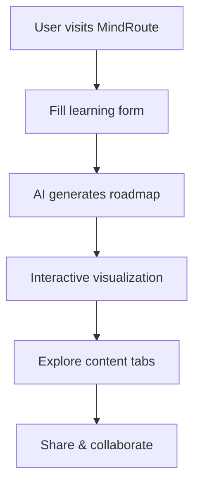

# 🗺️ MindRoute - AI-Powered Learning Roadmap Generator


[](https://nextjs.org/)
[](https://www.typescriptlang.org/)
[](https://reactjs.org/)
[](https://tailwindcss.com/)
[](https://supabase.com/)
[](LICENSE)

> Transform your learning goals into interactive, personalized roadmaps with AI-powered insights and community-driven content.

## 📖 Table of Contents

### 🏗️ **Getting Started**
1. [Overview](#-overview)
2. [Features](#-features)

### 🛠️ **Development Guide**
5. [Architecture & Technology Stack](#-architecture--technology-stack)
6. [Project Structure](#-project-structure)
7. [User Flow & Functionality](#-user-flow--functionality)
8. [UI Components Guide](#-ui-components-guide)

### 📚 **Technical Documentation**
9. [API Reference](#-api-reference)
10. [Database Schema](#-database-schema)
11. [Tree-to-Flow Algorithm](#-tree-to-flow-algorithm)
12. [Background Jobs](#-background-jobs)

### 🎨 **Design & Assets**
13. [UI Design System](#-design-system)
14. [Component Library](#-ui-components-guide)
15. [Responsive Design](#-responsive-design)

---

## 🌟 Overview

**MindRoute** is an intelligent learning roadmap generator that transforms your educational goals into interactive, personalized learning paths. Built with modern web technologies and powered by AI, it provides:

### 🎯 **Core Features**
- **AI-Powered Generation**: Create custom learning roadmaps using GPT-4
- **Interactive Visualization**: Navigate through your learning journey with React Flow
- **Community Sharing**: Discover and share roadmaps with the community
- **Progress Tracking**: Monitor your learning progress with visual indicators
- **Multi-Format Content**: Courses, projects, and FAQ sections for comprehensive learning
- **Responsive Design**: Seamless experience across desktop, tablet, and mobile

### 🔧 **Key Capabilities**
- Generate roadmaps for any learning topic
- Personalize based on skill level and learning style
- Export roadmaps in multiple formats
- Real-time collaboration and sharing
- Integration with external learning resources

## ✨ Features

### 🤖 **AI-Powered Roadmap Generation**
- **Smart Input Form**: Collect learning goals, duration, skill level, and preferences
- **GPT-4 Integration**: Generate structured, comprehensive learning paths
- **Background Processing**: Inngest-powered job queue for seamless user experience
- **Customizable Prompts**: Tailor AI responses to specific learning domains

### 🎨 **Interactive Visualization**
- **Dynamic Flowcharts**: Navigate learning paths with React Flow
- **Custom Node System**: Color-coded topics with hierarchical organization
- **Multiple View Modes**: Switch between flowchart and tree hierarchy
- **Zoom & Pan Controls**: Explore large roadmaps with ease

### 📚 **Comprehensive Content**
- **Roadmap Tab**: Interactive flowchart with clickable nodes
- **Courses Tab**: Curated course recommendations
- **Projects Tab**: Hands-on projects and templates
- **FAQ Tab**: Common questions and expert answers

### 👥 **Community Features**
- **Public Roadmaps**: Browse featured community roadmaps
- **Private Workspaces**: Create and manage personal roadmaps
- **Sharing System**: Generate shareable links for collaboration
- **User Authentication**: Secure access with Clerk integration


## 🏗️ Architecture & Technology Stack  

MindRoute is built on a modern, scalable architecture that combines the best of React ecosystem with powerful AI capabilities:

### 🔧 **Core Technologies**

#### **Frontend Framework**
- **Next.js 15.1.8**: App Router, Server Components, API Routes
- **React 19.1.0**: Functional components with modern hooks
- **TypeScript 5.x**: Full type safety and developer experience

#### **Styling & UI**
- **Tailwind CSS 3.4.1**: Utility-first styling with custom design system
- **React Flow 11.11.4**: Interactive flowchart visualization
- **Framer Motion 12.15.0**: Smooth animations and transitions
- **Lucide React**: Modern icon library

#### **Data & State Management**
- **Supabase 2.49.8**: PostgreSQL database with real-time subscriptions
- **Clerk 6.20.0**: Authentication and user management
- **React Context**: Global state management
- **Inngest 3.38.0**: Background job processing

#### **AI & External APIs**
- **OpenAI GPT-4**: Via GitHub Models API for roadmap generation
- **Custom Prompts**: Engineered for educational content generation
- **Background Processing**: Async AI generation with progress tracking

### 📁 **Project Structure**

```
tattva/
├── 📱 app/                           # Next.js App Router
│   ├── 🏠 pages/mindroute/          # Main MindRoute interface
│   │   ├── page.tsx                 # Landing page with form
│   │   └── _components/             # Page-specific components
│   │       ├── form_comp.tsx        # Input form
│   │       ├── header_2.tsx         # Page header
│   │       └── RoadmapGrip.tsx      # Roadmap grid display
│   │
│   ├── 🗺️ (routes)/roadmap/[libid]/ # Dynamic roadmap pages
│   │   ├── page.tsx                 # Roadmap visualization
│   │   └── _components/             # Roadmap components
│   │       ├── CustomNode.tsx       # Interactive nodes
│   │       ├── HierarchyModal.tsx   # Tree view
│   │       ├── LoadingStatus.tsx    # Progress indicators
│   │       └── tabs/                # Content tabs
│   │           ├── roadmap-tab.tsx  # Flowchart view
│   │           ├── courses-tab.tsx  # Course recommendations
│   │           ├── projects-tab.tsx # Project suggestions
│   │           └── faq_questions-tab.tsx # FAQ section
│   │
│   ├── 🔌 api/                      # Backend API routes
│   │   ├── roadmap/route.ts         # Roadmap generation
│   │   ├── roadmap-extra-data/      # Additional content
│   │   └── generate-hierarchy-json/ # Tree structure API
│   │
│   ├── 🧩 components/               # Shared components
│   │   ├── types/roadmap.ts         # TypeScript interfaces
│   │   └── utils/                   # Utility functions
│   │       ├── tree-to-flow.ts      # Converts tree to flowchart
│   │       ├── helpers.ts           # Common utilities
│   │       └── prompt.ts            # AI prompt templates
│   │
│   └── 🔧 services/                 # External integrations
│       ├── supabase.tsx             # Database client
│       └── constants.ts             # Configuration
│
├── ⚡ inngest/                      # Background jobs
│   ├── client.ts                    # Inngest configuration
│   └── functions.ts                 # Job definitions
│
├── 🎨 public/                       # Static assets
└── 📝 docs/                         # Documentation
    ├── mindroute-user-flow.md       # User flow diagrams
    └── mindroute-ui-design-guide.md # UI component guide
```

## 🌊 User Flow & Functionality

For detailed user flow documentation, see: **[MindRoute User Flow Guide](./mindroute-user-flow.md)** ⇠⇠⇠⇠⇠⇠⇠⇠⇠👈🏻

### 🎯 **Core User Journey**



### 📝 **Step-by-Step Process**

1. **Input Collection**
   - Learning goal (e.g., "Frontend Developer")
   - Duration preference (e.g., "12 weeks")
   - Weekly time commitment
   - Current skill level
   - Learning style preference

2. **AI Processing**
   - Background job triggered via Inngest
   - GPT-4 generates structured roadmap
   - Content saved to Supabase database

3. **Visualization**
   - Tree-to-flow algorithm converts data
   - Interactive React Flow component renders
   - Color-coded hierarchical layout

4. **Content Exploration**
   - Navigate flowchart nodes
   - Switch between content tabs
   - Access courses, projects, and FAQ

5. **Collaboration**
   - Share roadmap with unique URLs
   - Public/private visibility options
   - Community discovery features

## 🎨 UI Components Guide

For comprehensive UI documentation, see: **[MindRoute UI Design Guide](./mindroute-ui-design-guide.md)**   ⇠⇠⇠⇠⇠⇠⇠⇠⇠👈🏻

### 🧩 **Core Components**

#### **Form Component** (`form_comp.tsx`)
- Multi-field input collection
- Real-time validation
- Dropdown menus with icons
- Progress indication

#### **Interactive Flowchart** (`CustomNode.tsx`)
- Custom React Flow nodes
- Color-coded hierarchy
- Hover and click interactions
- Connection handles

#### **Tab Navigation** (`tab-navigation.tsx`)
- Four content sections
- Smooth transitions
- Mobile-responsive
- Progress indicators

#### **Loading States** (`LoadingStatus.tsx`)
- Progressive loading bars
- Status message updates
- Skeleton animations
- Error handling

### 🎨 **Design System**

#### **Color Palette**
- **Primary**: `#178d73` (Teal green)
- **Background**: `#131a19` (Dark gray-green)
- **Borders**: `#2d3d3b` (Medium gray-green)
- **Text**: White with gray placeholders

#### **Typography**
- **Headers**: 2.5rem, bold, tight letter-spacing
- **Body**: 1rem, regular, 1.6 line-height
- **Captions**: 0.875rem, medium, 0.8 opacity

## 📚 API Reference

### 🔌 **Core Endpoints**

#### **POST** `/api/roadmap`
Generate a new roadmap with AI assistance.

**Request Body:**
```json
{
  "libId": "uuid-string",
  "formData": {
    "goal": "Frontend Developer",
    "duration": "12 Weeks",
    "weeklyHours": "10 Hours/week",
    "skillLevel": "beginner",
    "learningStyle": "mixed"
  }
}
```

**Response:**
```json
{
  "inngestRunId": "job-id-string",
  "status": "processing"
}
```

#### **GET** `/api/roadmap-extra-data`
Fetch additional content for existing roadmaps.

#### **POST** `/api/generate-hierarchy-json`
Convert AI response to structured hierarchy.

### 🗄️ **Database Schema**

#### **Library Table**
```sql
CREATE TABLE Library (
  id SERIAL PRIMARY KEY,
  libId UUID UNIQUE NOT NULL,
  userEmail TEXT,
  searchInput TEXT,
  type TEXT DEFAULT 'roadmap',
  created_at TIMESTAMP DEFAULT NOW()
);
```

#### **Roadmap Table**
```sql
CREATE TABLE Roadmap (
  id SERIAL PRIMARY KEY,
  libId UUID REFERENCES Library(libId),
  FormData JSONB,
  AiResp JSONB,
  Visiblity TEXT DEFAULT 'private',
  created_at TIMESTAMP DEFAULT NOW()
);
```

#### **NodeData Table**
```sql
CREATE TABLE NodeData (
    id SERIAL PRIMARY KEY,
    libId UUID REFERENCES Roadmap(libId),
    HierarchySelectedText TEXT,
    generatedResp JSONB,
    created_at TIMESTAMP DEFAULT NOW()
);
```

## 🧠 Tree-to-Flow Algorithm

The core visualization algorithm converts hierarchical AI responses into interactive flowcharts:

### 🌳 **Algorithm Overview**

```typescript
export function generateSpineFlow(topic: string, tree: TopicNode[]) {
  // 1. Create central spine with main topics
  // 2. Branch child topics horizontally (alternating sides)
  // 3. Calculate optimal positioning
  // 4. Generate React Flow nodes and edges
  
  return { nodes, edges };
}
```

### 📐 **Layout Strategy**
- **Central Spine**: Vertical sequence of main topics
- **Horizontal Branches**: Child topics extend left/right
- **Dynamic Spacing**: Adjusts based on content hierarchy
- **Connection Handles**: Proper edge routing between nodes

For complete implementation details, see: **[Tree-to-Flow Documentation](./tree-to-flow-conversion.md)**

## ⚡ Background Jobs

MindRoute uses Inngest for reliable background processing:

### 🔄 **Job Types**

#### **RoadmapModel Job**
- Processes form data with AI
- Generates structured learning path
- Saves results to database
- Handles errors and retries

#### **RoadmapExtraData Job**
- Fetches course recommendations
- Generates project suggestions
- Populates FAQ content
- Updates existing roadmaps

### 📊 **Job Monitoring**
- Real-time status updates
- Progress indicators in UI
- Error logging and alerts
- Performance metrics
