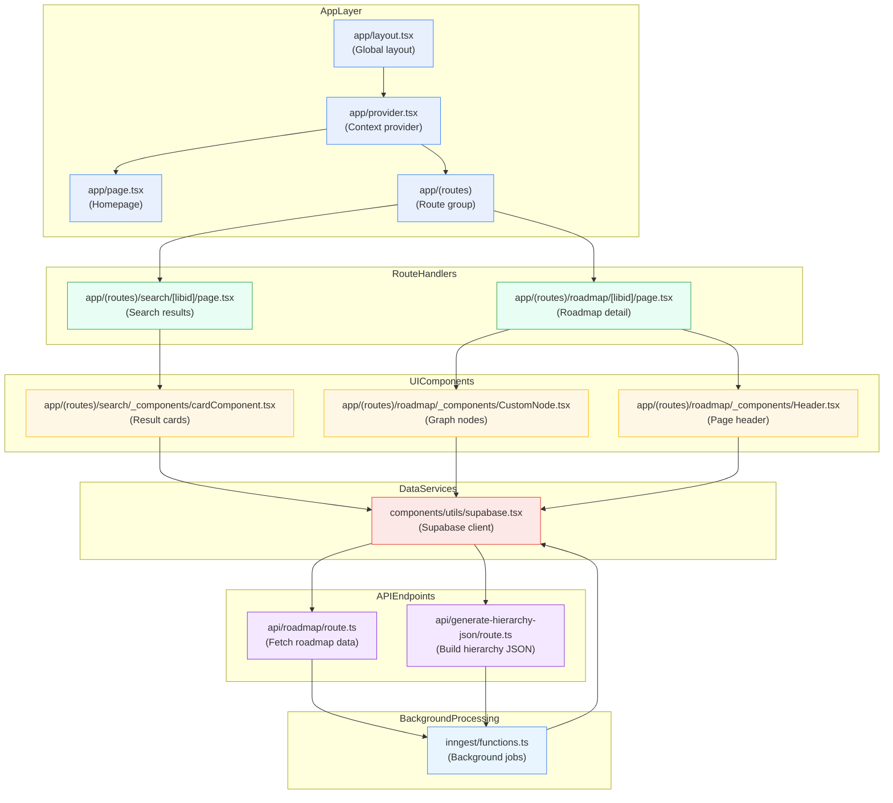

# MindRoute Feature Flowchart

The diagram below illustrates how the MindRoute feature flows through the application, using the folder structure to map each logical step.

This flowchart shows:

1. **App Layer**: The root `app/` folder bootstraps the layout and context provider.
2. **Route Handlers**: Dynamic pages under `app/(routes)` handle search and roadmap views.
3. **UI Components**: Each page imports presentational components from the `_components` folders.
4. **Data Services**: Shared `supabase.tsx` provides the client for database queries.
5. **API Endpoints**: Next.js route files under `api/` fetch or generate required data.
6. **Background Processing**: Inngest jobs handle long-running tasks and feed results back into the system.
