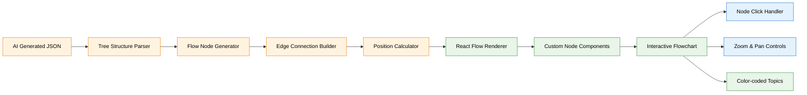
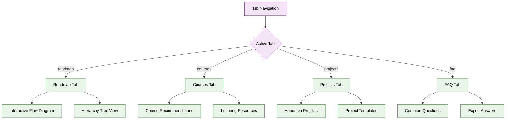

# MindRoute User Flow Flowchart

This flowchart shows the complete user journey through the MindRoute feature, from initial input to roadmap generation and display.

```mermaid
flowchart TD
    %% User Entry Point
    A[User visits MindRoute page] --> B[app/pages/mindroute/page.tsx]
    
    %% Initial Page Load
    B --> C[Fetch public roadmaps from Supabase]
    B --> D[Fetch user's private roadmaps if authenticated]
    C --> E[Display Featured Roadmaps]
    D --> F[Display Private Roadmaps]
    
    %% Form Display
    E --> G[Show MindRoute Form]
    F --> G
    G --> H[app/pages/mindroute/_components/form_comp.tsx]
    
    %% User Input Collection
    H --> I{User fills form fields}
    I --> J[Learning Goal: e.g., Frontend Developer]
    I --> K[Duration: e.g., 12 Weeks]
    I --> L[Weekly Hours: e.g., 10 Hours/week]
    I --> M[Skill Level: Beginner/Intermediate/Advanced]
    I --> N[Learning Style: Videos/Articles/Projects/Interactive/Mixed]
    
    %% Form Validation
    J --> O{All fields filled?}
    K --> O
    L --> O
    M --> O
    N --> O
    
    O -->|No| P[Show validation errors]
    P --> I
    O -->|Yes| Q[Enable Generate Roadmap button]
    
    %% Roadmap Generation Process
    Q --> R[User clicks Generate Roadmap]
    R --> S[Generate unique libId using UUID]
    S --> T[Check if libId exists in database]
    
    T -->|Exists| U[Log error: Query already exists]
    T -->|New| V[Save to Library table]
    
    V --> W[Insert user email, search input, libId, type=roadmap]
    W --> X[Save to Roadmap table]
    X --> Y[Insert libId and form data]
    
    %% Navigation to Roadmap Page
    Y --> Z["Redirect to /roadmap/{libId}"]
    Z --> AA["app/routes/roadmap/{libid}/page.tsx"]
    
    %% Roadmap Page Loading
    AA --> BB[Initialize loading states]
    BB --> CC[Fetch roadmap data from Supabase]
    CC --> DD{Roadmap exists?}
    
    DD -->|No| EE[Show error message]
    DD -->|Yes| FF{AI response available?}
    
    FF -->|No| GG[Show loading status]
    FF -->|Yes| HH[Parse roadmap data]
    
    %% Background Processing
    GG --> II[Trigger background job]
    II --> JJ[inngest/functions.ts - RoadmapModel]
    JJ --> KK[Call AI API with form data]
    KK --> LL[Generate roadmap structure using AI]
    LL --> MM[Save AI response to database]
    MM --> NN[Update roadmap with AiResp]
    
    %% Data Processing
    HH --> OO[Process roadmap hierarchy]
    NN --> OO
    OO --> PP[Generate flow nodes and edges]
    PP --> QQ[Build parent-child relationships]
    QQ --> RR[Calculate node positions]
    
    %% UI Rendering
    RR --> SS[Render roadmap visualization]
    SS --> TT[Show interactive flowchart]
    TT --> UU[Display topic nodes with colors]
    UU --> VV[Enable node interactions]
    
    %% Additional Features
    VV --> WW[Show tabs: Roadmap/Courses/Projects/FAQ]
    WW --> XX[Allow hierarchy view toggle]
    XX --> YY[Enable roadmap sharing]
    
    %% User Interactions
    YY --> ZZ{User actions}
    ZZ --> AAA[Click node for details]
    ZZ --> BBB[Switch between tabs]
    ZZ --> CCC[View in hierarchy mode]
    ZZ --> DDD[Share roadmap]
    
    AAA --> EEE[Show topic description]
    BBB --> FFF[Load courses/projects/FAQ data]
    CCC --> GGG[Display tree hierarchy]
    DDD --> HHH[Generate share link]
    
    %% Styling
    classDef userAction fill:#E3F2FD,stroke:#1976D2,stroke-width:2px,color:#000000
    classDef component fill:#F3E5F5,stroke:#7B1FA2,stroke-width:2px,color:#000000
    classDef database fill:#E8F5E8,stroke:#388E3C,stroke-width:2px,color:#000000
    classDef process fill:#FFF3E0,stroke:#F57C00,stroke-width:2px,color:#000000
    classDef decision fill:#FFEBEE,stroke:#D32F2F,stroke-width:2px,color:#000000
    classDef ai fill:#E1F5FE,stroke:#0288D1,stroke-width:2px,color:#000000
    
    class A,R,I,ZZ,AAA,BBB,CCC,DDD userAction
    class B,H,AA component
    class C,D,V,W,X,Y,CC,MM,NN database
    class S,OO,PP,QQ,RR,SS,II,JJ,KK,LL process
    class O,T,DD,FF decision
    class LL,KK,JJ ai
```



## Key Components in the Flow:

### 1. **Entry Points**
- **Main Page**: `app/pages/mindroute/page.tsx` - Main MindRoute landing page
- **Form Component**: `app/pages/mindroute/_components/form_comp.tsx` - Input form

### 2. **User Input Fields**
- **Learning Goal**: What the user wants to learn (e.g., "Frontend Developer")
- **Duration**: How long they want to spend (e.g., "12 Weeks")
- **Weekly Hours**: Time commitment per week (e.g., "10 Hours/week")
- **Skill Level**: Current expertise level (Beginner/Intermediate/Advanced)
- **Learning Style**: Preferred learning method (Videos/Articles/Projects/Interactive/Mixed)

### 3. **Database Operations**
- **Library Table**: Stores user search input, email, libId, and type
- **Roadmap Table**: Stores form data and AI-generated roadmap structure

### 4. **AI Processing**
- **Background Job**: `inngest/functions.ts` - RoadmapModel function
- **AI Model**: Uses OpenAI GPT-4 via GitHub Models API
- **Prompt Engineering**: Converts form data to structured roadmap

### 5. **Visualization**
- **Flow Generation**: Converts AI response to interactive flowchart
- **Node System**: Custom nodes with colors and hierarchy
- **Interactive Features**: Click nodes, switch tabs, hierarchy view

### 6. **Additional Features**
- **Tabs**: Roadmap, Courses, Projects, FAQ sections
- **Sharing**: Generate shareable roadmap links
- **Private/Public**: Support for both private and public roadmaps
- **Real-time Updates**: Background processing with loading states

## Data Flow Summary:

1. **Input Collection** → Form validates all required fields
2. **Database Storage** → Creates Library and Roadmap records
3. **AI Processing** → Background job generates structured roadmap
4. **Visualization** → Converts AI response to interactive flowchart
5. **User Interaction** → Browse, share, and explore generated roadmap

## Content Display Architecture:

### 1. **Roadmap Visualization Display**


### 2. **Content Display Components**

#### **Main Roadmap View** (`app/(routes)/roadmap/[libid]/page.tsx`)
- **Loading States**: Progressive loading with status indicators
- **Error Handling**: Graceful error messages for failed generations
- **Tab Navigation**: Switch between different content types
- **Responsive Layout**: Adapts to different screen sizes

#### **Interactive Flowchart** (`_components/CustomNode.tsx`)
- **Node Types**: Different visual styles for different topic levels
- **Color Coding**: Hierarchical color scheme (parent → child relationships)
- **Hover Effects**: Interactive feedback on node hover
- **Click Actions**: Node selection and detail view triggers

#### **Content Tabs System**


### 3. **Visual Hierarchy & Layout**

#### **Node Display Structure**
- **Root Nodes**: Largest size, primary color scheme
- **Branch Nodes**: Medium size, secondary colors
- **Leaf Nodes**: Smaller size, tertiary colors
- **Connection Lines**: Curved edges showing relationships

#### **Information Architecture**
```
┌─ Header (Navigation & Controls)
├─ Loading Status (Progress Indicators)  
├─ Tab Navigation (Roadmap/Courses/Projects/FAQ)
├─ Main Content Area
│  ├─ Flowchart Canvas (Zoom/Pan enabled)
│  ├─ Node Details Panel (On selection)
│  └─ Hierarchy Modal (Tree view)
└─ Footer (Share/Export options)
```

### 4. **Dynamic Content Loading**

#### **Progressive Enhancement**
1. **Initial Load**: Show basic roadmap structure
2. **Background Jobs**: Load additional content (courses, projects, FAQ)
3. **Lazy Loading**: Load detailed content on-demand
4. **Real-time Updates**: Refresh content as background jobs complete

#### **Content Sources**
- **AI Generated**: Core roadmap structure from GPT-4
- **External APIs**: Course recommendations, project ideas
- **Database Cache**: Previously generated content
- **User Generated**: Custom notes and modifications

### 5. **Interactive Features Display**

#### **Node Interaction States**
- **Default**: Standard appearance with title and brief description
- **Hover**: Highlighted border, tooltip with additional info
- **Selected**: Expanded view with detailed content
- **Completed**: Visual indicator showing progress status

#### **Modal System** (`_components/HierarchyModal.tsx`)
- **Tree View**: Alternative hierarchical display
- **Detailed Descriptions**: Extended topic explanations
- **Resource Links**: Direct links to learning materials
- **Progress Tracking**: Completion status indicators

### 6. **Responsive Display Patterns**

#### **Desktop View**
- **Full Canvas**: Large flowchart with all nodes visible
- **Side Panels**: Additional content in sidebars
- **Multi-tab Interface**: All tabs accessible simultaneously

#### **Mobile View**
- **Collapsible Sections**: Accordion-style content organization
- **Touch Interactions**: Swipe and tap gestures
- **Simplified Navigation**: Streamlined interface for smaller screens

### 7. **Data Visualization Techniques**

#### **Flow Chart Rendering**
- **Automatic Layout**: Algorithm-based node positioning
- **Curve Algorithms**: Smooth connection lines between nodes
- **Zoom Controls**: Scale in/out for better navigation
- **Mini-map**: Overview of entire roadmap structure

#### **Content Formatting**
- **Markdown Support**: Rich text formatting in descriptions
- **Code Highlighting**: Syntax highlighting for technical content
- **Media Embedding**: Images, videos, and interactive elements
- **Link Management**: External resource integration

## Tree-to-Flow Conversion Implementation

Understanding how AI-generated roadmap data is converted into an interactive flowchart is crucial for creating similar visualization features. Here's the complete implementation guide:

### 8. **Data Structure Overview**

The tree-to-flow conversion uses three main TypeScript interfaces:

```typescript
// Core data structures from app/components/types/roadmap.ts
export type TopicNode = {
  label: string;
  children?: TopicNode[];
};

export type FlowNode = {
  id: string;
  data: { 
    label: string;
    topicNode?: TopicNode;
  };
  position: { x: number; y: number };
  sourcePosition: string;
  targetPosition: string;
};

export type FlowEdge = {
  id: string;
  source: string;
  target: string;
  sourceHandle?: string;
  targetHandle?: string;
};
```

### 9. **Tree-to-Flow Algorithm** (`app/components/utils/tree-to-flow.ts`)

#### **Core Conversion Function**

```typescript
export function generateSpineFlow(topic: string, tree: TopicNode[]) {
  idCounter = 1;
  edgeCounter = 1;
  const nodes: FlowNode[] = [];
  const edges: FlowEdge[] = [];

  const centerX = 800;    // Center X position for spine
  const startY = 50;      // Starting Y position
  const spineSpacing = 20; // Extra spacing between spine nodes
  const dy = 80;          // Vertical spacing between nodes

  // Step 1: Create root node
  const root = createNode(`${topic} Roadmap`, centerX, startY);
  nodes.push(root);

  let currentY = startY + 100;
  let previousNodeId = root.id;

  // Step 2: Process each main topic in the tree
  for (let i = 0; i < tree.length; i++) {
    const topicNode = tree[i];
    const nodeY = currentY;
    
    // Create spine node
    const node = createNode(topicNode.label, centerX, nodeY, topicNode);
    nodes.push(node);

    // Connect to previous spine node vertically
    edges.push({
      id: `spine-${previousNodeId}-${node.id}-${edgeCounter++}`,
      source: previousNodeId,
      target: node.id,
      sourceHandle: "bottom",
      targetHandle: "top",
    });

    previousNodeId = node.id;

    // Step 3: Layout child nodes if they exist
    if (topicNode.children?.length) {
      const direction = i % 2 === 0 ? 1 : -1; // Alternate left/right
      const subtreeHeight = getSubtreeHeight(topicNode, dy);
      const childrenStartY = nodeY - subtreeHeight / 2;

      // Recursively layout children
      layoutSubtreeRecursive(
        node.id,
        centerX,
        childrenStartY,
        topicNode.children,
        direction,
        nodes,
        edges
      );

      currentY += Math.max(subtreeHeight, dy);
    } else {
      currentY += dy;
    }

    currentY += spineSpacing;
  }

  return { nodes, edges };
}
```

#### **Helper Functions**

```typescript
// Creates a new FlowNode with unique ID and positioning
function createNode(
  label: string,
  x: number,
  y: number,
  topicNode?: TopicNode
): FlowNode {
  return {
    id: `${idCounter++}`,
    data: { label, topicNode },
    position: { x, y },
    sourcePosition: 'bottom',
    targetPosition: 'top',
  };
}

// Calculates total height needed for a subtree
function getSubtreeHeight(topic: TopicNode, nodeHeight = 80): number {
  if (!topic.children || topic.children.length === 0) return nodeHeight;
  return topic.children.reduce(
    (sum, child) => sum + getSubtreeHeight(child, nodeHeight),
    0
  );
}

// Recursively layouts child nodes in horizontal branches
function layoutSubtreeRecursive(
  parentId: string,
  parentX: number,
  startY: number,
  children: TopicNode[],
  direction: 1 | -1,  // 1 = right, -1 = left
  nodes: FlowNode[],
  edges: FlowEdge[],
  depth = 1
): number {
  const dx = 300; // Horizontal spacing between levels
  const dy = 100; // Vertical spacing between siblings

  let currentY = startY;

  for (const child of children) {
    const subtreeHeight = getSubtreeHeight(child, dy);
    const nodeX = parentX + direction * dx * depth;
    const nodeY = currentY + subtreeHeight / 2;

    const node = createNode(child.label, nodeX, nodeY, child);
    nodes.push(node);

    // Create edge with proper handle connections
    edges.push({
      id: `child-${parentId}-${node.id}-${edgeCounter++}`,
      source: parentId,
      target: node.id,
      sourceHandle: direction === 1 ? "right" : "left-source",
      targetHandle: direction === 1 ? "left" : "right-target",
    });

    // Recursively layout grandchildren
    if (child.children?.length) {
      layoutSubtreeRecursive(
        node.id,
        nodeX,
        currentY,
        child.children,
        direction,
        nodes,
        edges,
        depth + 1
      );
    }

    currentY += subtreeHeight;
  }

  return currentY;
}
```

### 10. **Layout Strategy Explained**

#### **Spine-Based Layout**
The algorithm creates a **central vertical spine** with main topics, then branches child topics horizontally:

```
    Root Topic
        |
   Main Topic 1 ——— Child 1.1 ——— Grandchild 1.1.1
        |            └——— Child 1.2
        |
   Main Topic 2 
        |            ┌——— Child 2.1
        |    ┌——————— Child 2.2 ——— Grandchild 2.2.1
   Main Topic 3      └——— Child 2.3
        |
   Main Topic 4 ——— Child 4.1
```

#### **Key Features:**
1. **Alternating Sides**: Child topics alternate between left and right sides of the spine
2. **Dynamic Spacing**: Vertical spacing adjusts based on subtree height
3. **Recursive Layout**: Supports unlimited nesting levels
4. **Handle Management**: Proper connection points for smooth edge routing

### 11. **Usage Example**

```typescript
// Example AI response structure
const aiGeneratedTree: TopicNode[] = [
  {
    label: "HTML Fundamentals",
    children: [
      { label: "Elements & Attributes" },
      { label: "Semantic HTML" },
      { label: "Forms & Validation" }
    ]
  },
  {
    label: "CSS Styling",
    children: [
      { 
        label: "Layout Systems",
        children: [
          { label: "Flexbox" },
          { label: "Grid" },
          { label: "Positioning" }
        ]
      },
      { label: "Responsive Design" }
    ]
  },
  {
    label: "JavaScript Basics",
    children: [
      { label: "Variables & Functions" },
      { label: "DOM Manipulation" },
      { label: "Event Handling" }
    ]
  }
];

// Convert to flowchart
const { nodes, edges } = generateSpineFlow("Frontend Development", aiGeneratedTree);

// Use with React Flow
<ReactFlow 
  nodes={nodes} 
  edges={edges} 
  nodeTypes={{ custom: CustomNode }}
/>
```

### 12. **Customization Options**

You can modify the layout by adjusting these constants:

```typescript
const layoutConfig = {
  centerX: 800,        // Horizontal center position
  startY: 50,          // Top margin
  spineSpacing: 20,    // Extra space between spine nodes  
  horizontalGap: 300,  // Distance between levels
  verticalGap: 100,    // Distance between siblings
  nodeHeight: 80       // Standard node height
};
```

### 13. **Integration with React Flow**

The generated nodes and edges integrate seamlessly with React Flow:

```typescript
import ReactFlow, { Background, Controls, MiniMap } from 'reactflow';
import 'reactflow/dist/style.css';

function RoadmapVisualization({ aiResponse }) {
  const { nodes, edges } = generateSpineFlow(
    aiResponse.topic, 
    aiResponse.structure
  );

  return (
    <div style={{ height: '100vh' }}>
      <ReactFlow
        nodes={nodes}
        edges={edges}
        nodeTypes={{ custom: CustomNode }}
        fitView
        attributionPosition="bottom-left"
      >
        <Background />
        <Controls />
        <MiniMap />
      </ReactFlow>
    </div>
  );
}
```

This implementation provides a flexible, scalable foundation for converting hierarchical learning data into interactive visualizations that users can explore and navigate intuitively.
